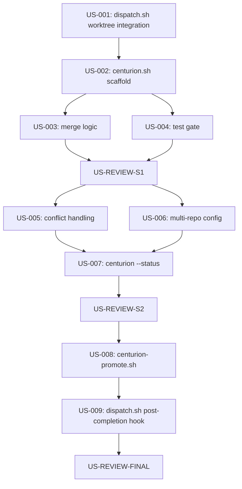

# PRD: Centurion Merge Agent

## Introduction

Centurion isolates coding agents into git worktrees, auto-merges completed feature branches to `develop`, runs tests as a gate, and promotes `develop` to `master` on manual command. This eliminates cross-contamination between concurrent agents, prevents unmerged branch pile-up, and enforces test gates before master.

## Goals

- Agents work in isolated worktrees — no shared working directory conflicts
- Feature branches merge to `develop` automatically after agent completion + test pass
- Test failures block merge (with conflict/failure reporting via wake-gateway.sh)
- `develop` promotes to `master` only on explicit manual trigger
- Status command shows branch state, pending merges, and test results at a glance

## Task Summary
**Total Tasks**: 12 (9 implementation + 3 reviews)
**Estimated Time**: ~115 min (~2 hours)
**Progress**: 4/12 complete (33%)
**Status**: IN PROGRESS
**Next Task**: US-REVIEW-S1

## Task Dependencies


---

## Sprint 1: Core Merge Pipeline (~45 min)
**Priority:** HIGH
**Purpose:** Wire worktrees into dispatch, build centurion merge + test gate
**Status:** COMPLETE

- [x] **US-001** Integrate worktree-manager into dispatch.sh (~10 min, ~25 lines)
- [x] **US-002** Create centurion.sh scaffold with argument parsing (~10 min, ~40 lines)
- [x] **US-003** Implement merge feature-branch-to-develop logic (~10 min, ~35 lines) [depends: US-002]
- [x] **US-004** Implement test gate runner (~10 min, ~30 lines) [depends: US-002]
- [x] **US-REVIEW-S1** Sprint 1 Review 🚧 GATE (~5 min)

---

### US-001: Integrate worktree-manager into dispatch.sh (~10 min, ~25 lines)

**Implementation:**
- File: `scripts/dispatch.sh` (modify existing)
- Reference: `scripts/worktree-manager.sh` (already exists — provides `create`, `destroy`, `cleanup`)
- Target: ~25 lines added/modified

**Approach:**
- After argument parsing and before tmux session launch (~line 459), call `worktree-manager.sh create "$BEAD_ID" "$REPO_PATH"` and capture the worktree path
- Replace `$REPO_PATH` with the worktree path for the tmux session's `-c` directory and the runner script
- Store the original repo path in a variable (needed for worktree cleanup later)
- In `complete_run()`, after verification and before session cleanup, call `worktree-manager.sh destroy "$BEAD_ID" "$ORIGINAL_REPO_PATH" --force` (force because agent may leave uncommitted work — that's fine, commits are on the branch)
- Add `WORKTREE_PATH` and `ORIGINAL_REPO_PATH` as globals alongside existing state vars
- Do NOT modify worktree-manager.sh itself
- Do NOT change the tmux session naming convention
- Do NOT add worktree creation for non-git repo paths (codex `--skip-git-repo-check` case)

**Acceptance Criteria:**
- `scripts/dispatch.sh` includes worktree-manager.sh calls
- Run: `bash -n scripts/dispatch.sh`
- Expected: exit 0 (no syntax errors)
- Run: `grep -c "worktree-manager" scripts/dispatch.sh`
- Expected: 2 or more matches (create + destroy)
- Worktree path is used as tmux working directory instead of raw repo path
- Original repo path preserved for cleanup

### US-002: Create centurion.sh scaffold with argument parsing (~10 min, ~40 lines)

**Implementation:**
- File: `scripts/centurion.sh` (create new)
- Reference: `scripts/dispatch.sh` for style conventions (set -euo pipefail, SCRIPT_DIR, source libs)
- Target: ~40 lines

**Approach:**
- Create `scripts/centurion.sh` with standard header: `set -euo pipefail`, SCRIPT_DIR, WORKSPACE_ROOT
- Source `scripts/lib/common.sh` for shared utilities
- Usage: `centurion.sh <command> [args...]`
- Commands: `merge <bead-id> <repo-path>`, `--status [repo-path]`, `--help`
- Parse command and dispatch to stub functions: `cmd_merge()`, `cmd_status()`
- `cmd_merge` stub: validate args, echo "merge not yet implemented", exit 0
- `cmd_status` stub: echo "status not yet implemented", exit 0
- Do NOT implement actual merge logic yet (US-003)
- Do NOT implement actual status logic yet (US-007)
- Do NOT add promote command here (separate script, US-008)

**Acceptance Criteria:**
- File exists: `scripts/centurion.sh`
- Run: `bash -n scripts/centurion.sh`
- Expected: exit 0
- Run: `bash scripts/centurion.sh --help`
- Expected: usage text printed, exit 0
- Run: `chmod +x scripts/centurion.sh && test -x scripts/centurion.sh`
- Expected: exit 0

### US-003: Implement merge feature-branch-to-develop logic (~10 min, ~35 lines)

**Implementation:**
- File: `scripts/centurion.sh` (modify — replace `cmd_merge` stub)
- Reference: worktree-manager.sh branch naming: `bead-<bead-id>`
- Target: ~35 lines in `cmd_merge()`

**Approach:**
- `cmd_merge()` receives bead-id and repo-path
- Derive branch name: `bead-${bead_id}` (matches worktree-manager.sh convention)
- Validate branch exists: `git -C "$repo_path" show-ref --verify --quiet "refs/heads/bead-${bead_id}"`
- Ensure `develop` branch exists; if not, create from current `master`: `git -C "$repo_path" branch develop master`
- Checkout develop: `git -C "$repo_path" checkout develop`
- Attempt merge: `git -C "$repo_path" merge --no-ff "bead-${bead_id}" -m "centurion: merge bead-${bead_id}"`
- If merge succeeds, echo success message with commit hash
- If merge fails (conflict), abort: `git -C "$repo_path" merge --abort`, echo conflict details, exit 1
- Do NOT delete the feature branch after merge (cleanup is separate)
- Do NOT run tests here (US-004 handles test gate)
- Do NOT push to any remote

**Acceptance Criteria:**
- Run: `bash -n scripts/centurion.sh`
- Expected: exit 0
- Run: `grep "merge --no-ff" scripts/centurion.sh`
- Expected: 1 match
- Run: `grep "merge --abort" scripts/centurion.sh`
- Expected: 1 match (conflict handling)
- Develop branch created from master if it doesn't exist

### US-004: Implement test gate runner (~10 min, ~30 lines)

**Implementation:**
- File: `scripts/centurion.sh` (modify — add `run_test_gate()` function)
- Reference: `scripts/verify.sh` for test detection pattern (package.json -> npm test, go.mod -> go test)
- Target: ~30 lines

**Approach:**
- Add function `run_test_gate()` that takes repo-path as argument
- Detect test runner: check for `package.json` (npm test), `go.mod` (go test ./...), `Cargo.toml` (cargo test)
- Run tests with `timeout 300` to prevent hangs
- Capture exit code and last 50 lines of output
- Return 0 on pass, 1 on fail
- Wire into `cmd_merge()`: after successful merge, call `run_test_gate "$repo_path"`
- If test gate fails: revert the merge commit with `git -C "$repo_path" reset --hard HEAD~1`, echo failure details, exit 1
- If test gate passes: echo success, exit 0
- Do NOT duplicate verify.sh — this is a focused test-only gate (no lint, no truthsayer)
- Do NOT send wake signals here (dispatch.sh already handles that)

**Acceptance Criteria:**
- Run: `bash -n scripts/centurion.sh`
- Expected: exit 0
- Run: `grep "run_test_gate" scripts/centurion.sh`
- Expected: 2+ matches (definition + call)
- Run: `grep "timeout" scripts/centurion.sh`
- Expected: 1+ matches
- Test detection covers package.json, go.mod, Cargo.toml

### US-REVIEW-S1: Sprint 1 Review 🚧 GATE (~5 min)

**Scope:** US-001 through US-004

**Review Steps:**
- Run: `bash -n scripts/dispatch.sh`
- Expected: exit 0
- Run: `bash -n scripts/centurion.sh`
- Expected: exit 0
- Run: `bash scripts/centurion.sh --help`
- Expected: usage text, exit 0
- Verify dispatch.sh creates worktree before agent launch
- Verify dispatch.sh destroys worktree after agent completion
- Verify centurion.sh merge creates develop from master if needed
- Verify centurion.sh reverts merge on test failure

**Linus 5-Layer Analysis:**
1. **Data Structure Analysis**: Core data is branch names and repo paths. Flow: dispatch creates worktree branch -> centurion merges branch to develop. Clean separation?
2. **Special Case Identification**: Non-git repos skip worktree? Develop branch creation if missing? Are these real business cases or patches?
3. **Complexity Review**: Each function should be < 3 levels of indentation. Is merge+test gate simple enough?
4. **Destructive Analysis**: Does worktree integration break existing dispatch.sh behavior for non-worktree cases?
5. **Practicality Verification**: Does the merge flow match how agents actually produce commits?

**Taste Score:** Good taste / Acceptable / Garbage

**Gate:**
- If issues found: Create fix tasks (US-XXXa), output `<review-issues-found/>`
- If clean: Mark [x], commit "docs: US-REVIEW-S1 complete", output `<review-passed/>`

---

## Sprint 2: Resilience and Observability (~35 min)
**Priority:** HIGH
**Purpose:** Handle merge conflicts, multi-repo config, and status reporting
**Status:** COMPLETE

- [x] **US-005** Add conflict handling and wake notification (~10 min, ~25 lines) [depends: US-003]
- [x] **US-006** Add multi-repo test command config (~10 min, ~20 lines) [depends: US-002]
- [x] **US-007** Implement centurion --status command (~10 min, ~40 lines) [depends: US-005, US-006]
- [x] **US-007a** Scope centurion status results to the current repo (~5 min)
- [x] **US-REVIEW-S2** Sprint 2 Review 🚧 GATE (~5 min)

---

### US-005: Add conflict handling and wake notification (~10 min, ~25 lines)

**Implementation:**
- File: `scripts/centurion.sh` (modify `cmd_merge()`)
- Reference: `scripts/wake-gateway.sh` for notification pattern
- Target: ~25 lines added

**Approach:**
- When merge fails (conflict), capture the conflicting files: `git -C "$repo_path" diff --name-only --diff-filter=U`
- Call `wake-gateway.sh` with structured message: "Centurion: merge conflict for bead-${bead_id} in files: ${conflicting_files}"
- Write conflict state to `state/results/${bead_id}-centurion.json` with: bead, status="conflict", files, timestamp
- When test gate fails, also notify via wake-gateway.sh: "Centurion: test gate failed for bead-${bead_id}"
- Write test failure to same JSON file: status="test-failed", last_output (truncated to 200 chars)
- Use atomic write pattern (tmp + mv) matching record.sh conventions
- Do NOT retry merges automatically (human decision)
- Do NOT send duplicate wake signals (one per failure event)

**Acceptance Criteria:**
- Run: `bash -n scripts/centurion.sh`
- Expected: exit 0
- Run: `grep "wake-gateway" scripts/centurion.sh`
- Expected: 2+ matches (conflict + test failure)
- Run: `grep "centurion.json" scripts/centurion.sh`
- Expected: 1+ matches
- Conflict file list captured on merge failure

### US-006: Add multi-repo test command config (~10 min, ~20 lines)

**Implementation:**
- File: `config/agents.json` (modify — add `repos` section)
- File: `scripts/centurion.sh` (modify `run_test_gate()` to read config)
- Target: ~10 lines config + ~10 lines script

**Approach:**
- Add `repos` key to `config/agents.json`:
  ```json
  "repos": {
    "$HOME/athena-web": { "test_cmd": "npm test", "timeout": 120 },
    "$HOME/oathkeeper": { "test_cmd": "go test ./...", "timeout": 300 },
    "$HOME/truthsayer": { "test_cmd": "go test ./...", "timeout": 300 }
  }
  ```
- In `run_test_gate()`, look up repo path in config first: `jq -r ".repos[\"$repo_path\"].test_cmd // empty" "$CONFIG_FILE"`
- If config has explicit test_cmd, use it; otherwise fall back to existing auto-detect (package.json/go.mod/Cargo.toml)
- Read timeout from config, default to 300 if not specified
- Source `scripts/lib/config.sh` for config access (already exists)
- Do NOT add repos that don't exist on the system
- Do NOT add remote repo URLs

**Acceptance Criteria:**
- Run: `jq '.repos' config/agents.json`
- Expected: valid JSON object with 3 repo entries
- Run: `bash -n scripts/centurion.sh`
- Expected: exit 0
- Config-specified test commands take priority over auto-detect

### US-007: Implement centurion --status command (~10 min, ~40 lines)

**Implementation:**
- File: `scripts/centurion.sh` (modify — replace `cmd_status` stub)
- Reference: `scripts/worktree-manager.sh cmd_list` for worktree enumeration
- Target: ~40 lines

**Approach:**
- `cmd_status()` takes optional repo-path (if omitted, check all repos from config)
- For each repo, show:
  - Current branch of main worktree
  - Whether `develop` branch exists and its HEAD commit (short hash + message)
  - Number of unmerged feature branches: `git branch --list "bead-*" --no-merged develop`
  - Active agent worktrees (call `worktree-manager.sh list`)
  - Recent centurion results from `state/results/*-centurion.json`
- Format as human-readable table output
- If no repo-path given and config has `repos`, iterate all configured repos
- Do NOT output JSON (this is a human-facing command)
- Do NOT query remote branches

**Acceptance Criteria:**
- Run: `bash -n scripts/centurion.sh`
- Expected: exit 0
- Run: `bash scripts/centurion.sh --status $HOME/athena-web 2>&1 || true`
- Expected: output includes repo path and branch info (or clean error if develop doesn't exist yet)
- Status shows unmerged branch count

### US-REVIEW-S2: Sprint 2 Review 🚧 GATE (~5 min)

**Scope:** US-005 through US-007

**Review Steps:**
- Run: `bash -n scripts/centurion.sh`
- Expected: exit 0
- Run: `jq . config/agents.json`
- Expected: valid JSON, exit 0
- Run: `bash scripts/centurion.sh --status 2>&1 || true`
- Expected: status output or clean error
- Verify conflict handling writes state JSON
- Verify wake notifications sent on failures
- Verify config-driven test commands work

**Linus 5-Layer Analysis:**
1. **Data Structure Analysis**: Config adds repos section — does it compose cleanly with existing claude/codex config?
2. **Special Case Identification**: Missing develop branch, missing config entry, no test command found — how many special cases?
3. **Complexity Review**: Is status output simple enough to parse at a glance?
4. **Destructive Analysis**: Does agents.json modification break existing dispatch.sh config loading?
5. **Practicality Verification**: Will operators actually use --status, or is a different UX better?

**Taste Score:** Good taste / Acceptable / Garbage

**Gate:**
- If issues found: Create fix tasks, output `<review-issues-found/>`
- If clean: Mark [x], commit "docs: US-REVIEW-S2 complete", output `<review-passed/>`

---

## Sprint 3: Promotion and Integration (~35 min)
**Priority:** MEDIUM
**Purpose:** Add develop-to-master promotion and wire centurion into dispatch lifecycle
**Status:** COMPLETE

- [x] **US-008** Create centurion-promote.sh (~10 min, ~45 lines)
- [x] **US-008a** Extract shared test gate logic for centurion + promote scripts (~5 min)
- [x] **US-008b** Extract shared wake notification helper for centurion scripts (~5 min)
- [x] **US-009** Wire centurion merge into dispatch.sh post-completion (~10 min, ~20 lines) [depends: US-001, US-003]
- [x] **US-009a** Skip centurion merge for non-git repositories in dispatch completion (~5 min)
- [x] **US-REVIEW-FINAL** Final Cross-Sprint Review 🚧 GATE (~15 min)

---

### US-008: Create centurion-promote.sh (~10 min, ~45 lines)

**Implementation:**
- File: `scripts/centurion-promote.sh` (create new)
- Reference: centurion.sh for style, wake-gateway.sh for notifications
- Target: ~45 lines

**Approach:**
- Usage: `centurion-promote.sh <repo-path>`
- Manual trigger only — this script is never called automatically
- Validate repo path and that `develop` branch exists
- Run test gate on develop (reuse pattern from centurion.sh — call `run_test_gate` or inline the same logic)
- If tests fail: echo failure, send wake notification, exit 1
- If tests pass: `git -C "$repo_path" checkout master && git -C "$repo_path" merge --no-ff develop -m "centurion: promote develop to master"`
- If merge fails: abort, notify, exit 1
- If merge succeeds: echo success with commit hash, send wake notification "Centurion: promoted develop to master for $(basename $repo_path)"
- Add `--dry-run` flag that shows what would happen without executing
- Do NOT push to remote
- Do NOT delete develop branch after promotion
- Do NOT auto-promote (this is always manual)

**Acceptance Criteria:**
- File exists: `scripts/centurion-promote.sh`
- Run: `bash -n scripts/centurion-promote.sh`
- Expected: exit 0
- Run: `chmod +x scripts/centurion-promote.sh && test -x scripts/centurion-promote.sh`
- Expected: exit 0
- Run: `grep "\-\-dry-run" scripts/centurion-promote.sh`
- Expected: 1+ matches
- Tests run on develop before promotion
- Promotion uses --no-ff merge

### US-009: Wire centurion merge into dispatch.sh post-completion (~10 min, ~20 lines)

**Implementation:**
- File: `scripts/dispatch.sh` (modify `complete_run()`)
- Reference: US-001 worktree integration, centurion.sh merge command
- Target: ~20 lines added to `complete_run()`

**Approach:**
- In `complete_run()`, after verification passes and before worktree cleanup:
  - If status is "done" (agent completed successfully) AND verification overall is "pass":
    - Call `centurion.sh merge "$BEAD_ID" "$ORIGINAL_REPO_PATH"`
    - Capture exit code; log result but do NOT fail dispatch on centurion failure
    - If centurion merge succeeds, include in wake message: "merged to develop"
    - If centurion merge fails, include in wake message: "merge to develop failed"
  - If status is not "done" or verification failed: skip centurion merge
- The centurion merge call happens BEFORE worktree destroy (worktree destroy happens after because the branch is still needed during merge)
- Reorder: verify -> centurion merge -> worktree destroy -> cleanup
- Do NOT block dispatch completion on centurion failure
- Do NOT auto-promote to master (ever)

**Acceptance Criteria:**
- Run: `bash -n scripts/dispatch.sh`
- Expected: exit 0
- Run: `grep "centurion" scripts/dispatch.sh`
- Expected: 2+ matches
- Centurion merge only triggers on status="done" + verification="pass"
- Centurion failure does not block dispatch completion
- Worktree destroy happens after centurion merge

### US-REVIEW-FINAL: Final Cross-Sprint Review 🚧 GATE (~15 min)

**Scope:** All sprints (US-001 through US-009)

**Review Steps:**
- Run: `bash -n scripts/dispatch.sh`
- Expected: exit 0
- Run: `bash -n scripts/centurion.sh`
- Expected: exit 0
- Run: `bash -n scripts/centurion-promote.sh`
- Expected: exit 0
- Run: `jq . config/agents.json`
- Expected: valid JSON, exit 0
- Run: `bash scripts/centurion.sh --help`
- Expected: usage text, exit 0

**End-to-End Flow Verification:**
- Trace the full lifecycle: dispatch creates worktree -> agent works in worktree -> dispatch completes -> verify runs -> centurion merges to develop -> worktree destroyed
- Verify promote is separate manual step
- Verify --status shows meaningful output

**Cross-Sprint Consistency Checks:**
- Naming conventions consistent (bead-${bead_id} everywhere)?
- Error handling patterns uniform (exit 1 on fatal, warning on advisory)?
- No duplicate code between centurion.sh and centurion-promote.sh?
- Import structure clean (common.sh, config.sh sourced consistently)?
- All state files use atomic write pattern (tmp + mv)?

**Linus 5-Layer Analysis (Whole Feature):**
1. **Data Structure Analysis**: Branch lifecycle: feature branch -> develop -> master. State files: run records, results, centurion results. Does data flow cleanly?
2. **Special Case Identification**: Non-git repos, missing develop branch, no test command, concurrent merges to develop, agent failure before commit — how many special cases? Can any be eliminated?
3. **Complexity Review**: Can the whole system be explained in one sentence? "Dispatch isolates agents in worktrees, centurion merges passing branches to develop, promote moves develop to master."
4. **Destructive Analysis**: Does centurion break existing dispatch flow for users who don't want auto-merge? (It shouldn't — merge only on done+pass)
5. **Practicality Verification**: Does this solve the actual problem of branch pile-up and cross-contamination?

**Taste Score:** Good taste / Acceptable / Garbage

**VALIDATION GATE:**
- All 3 scripts pass `bash -n` syntax check?
- config/agents.json passes `jq .` validation?
- `--help` works on centurion.sh?
- `--status` produces output (or clean error)?
- No hardcoded repo paths in scripts (all from config or arguments)?
- Wake notifications sent on all failure paths?

**Gate:**
- If issues found: Create fix tasks, output `<review-issues-found/>`
- If clean: Mark [x], commit "docs: US-REVIEW-FINAL complete", output `<review-passed/>`

---

## Non-Goals

- No automatic promotion from develop to master (always manual via centurion-promote.sh)
- No remote push (all operations are local-only)
- No concurrent merge locking (git itself handles this; centurion runs sequentially per dispatch completion)
- No branch cleanup automation (worktree-manager already handles worktree cleanup; branch deletion is explicit)
- No CI/CD integration (this is local-only agent orchestration)
- No web UI or dashboard (--status is CLI-only)
- No merge strategy configuration (always --no-ff)

## Technical Considerations

- **Existing files to modify:** `scripts/dispatch.sh`, `config/agents.json`
- **New files to create:** `scripts/centurion.sh`, `scripts/centurion-promote.sh`
- **Dependencies:** git (worktrees, branches), bash, jq, existing lib scripts (common.sh, config.sh)
- **worktree-manager.sh:** Already exists and handles create/destroy/cleanup — centurion builds on top, does not duplicate
- **verify.sh:** Already handles test running — centurion's test gate is a focused subset (tests only, no lint/truthsayer)
- **Race condition:** Two agents finishing simultaneously could both try to merge to develop. Git will serialize these — second merge will be a fast-forward or clean merge in most cases. If conflict occurs, centurion reports it.
- **Repos:** athena-web (`$HOME/athena-web`, npm test), oathkeeper (`$HOME/oathkeeper`, go test ./...), truthsayer (`$HOME/truthsayer`, go test ./...)
- **Branch convention:** Feature branches are `bead-<bead-id>` (set by worktree-manager.sh). Develop branch created from master if missing. Master is the production branch.
