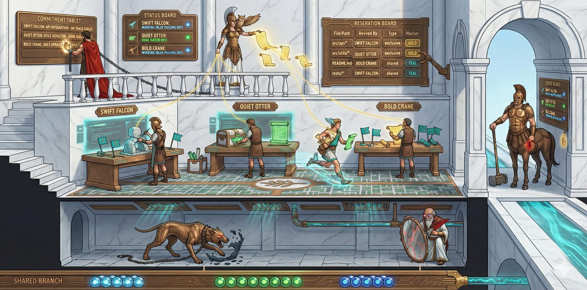
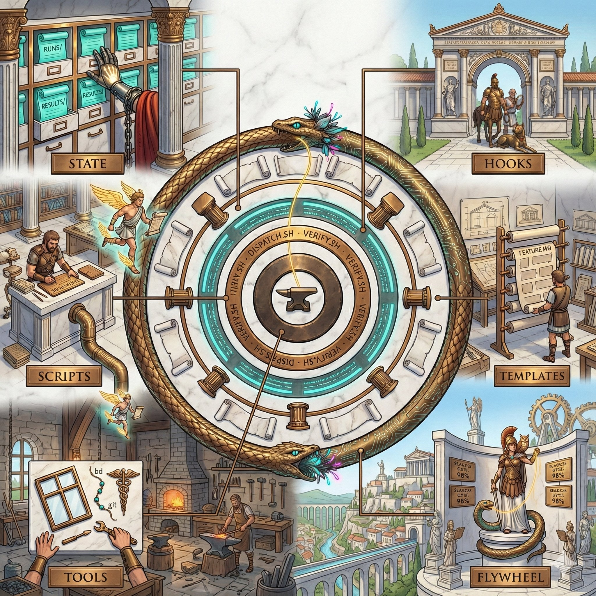

# 🏛️ Athena's Agora




_An autonomous coding system with an unreasonable commitment to naming things after Greek mythology._

---

Somewhere on a VPS, there's an AI named Athena orchestrating a swarm of coding agents. She decomposes work into beads, dispatches agents to tmux sessions, watches them through quality gates, and delivers verified results. When things go wrong — and they do — she figures it out, fixes it, and leaves a note.

This is her workspace. The command center. The agora where dispatch orders are written, strategies are planned, and agents are sent into the world.



## The Arsenal

Every tool in the Agora has a name, a purpose, and a mythology. They're standalone projects that work together as a system.

| Tool | What It Is | Repo |
|------|-----------|------|
| 👁️ [Argus](https://github.com/Perttulands/argus) | Ops watchdog — monitors health, takes corrective action | The faithful hound |
| 🏛️ [Athena Web](https://github.com/Perttulands/athena-web) | Dashboard — see every agent, bead, and run | The portal where all threads are visible |
| 🧵 [Beads](https://github.com/steveyegge/beads) | Work tracker — distributed, git-backed | The loom |
| ⚔️ Centurion | Test-gated merge — nothing reaches main unverified | The centaur (in this repo) |
| ⚖️ [Oathkeeper](https://github.com/Perttulands/oathkeeper) | Commitment tracker — if an agent promised, we check | The binding word |
| 🔍 [Truthsayer](https://github.com/Perttulands/truthsayer) | Anti-pattern scanner — 88 rules, 5 languages | The law keeper |
| 📡 [Relay](https://github.com/Perttulands/relay) | Agent messaging — filesystem-based, zero message loss | The herald |
| 🏟️ [Ludus Magnus](https://github.com/Perttulands/ludus-magnus) | Agent training — iterative prompt evolution | The training ground |
| 🔄 [Learning Loop](https://github.com/Perttulands/learning-loop) | Feedback flywheel — every run improves the next | The spiral path |

Read the full [mythology](mythology.md) for the story behind each name.

## Quick Start

```bash
# Clone
git clone https://github.com/Perttulands/athena-workspace.git ~/athena
cd ~/athena

# Setup (interactive — prompts for hostname, user, etc.)
./setup.sh

# Or non-interactive
ATHENA_USER=myuser ATHENA_HOME=/home/myuser ATHENA_HOSTNAME=my-vps ./setup.sh
```

## How It Works

```
Human → Athena (coordinator) → dispatch.sh → tmux session → coding agent
                                                   ↓
                                             watcher (background)
                                                   ↓
                                        verify.sh → wake Athena → deliver result
```

1. Work arrives as a **bead** on the loom
2. Athena dispatches a coding agent via `dispatch.sh` — fresh tmux session, fresh context
3. A background watcher monitors the agent
4. When done, `verify.sh` runs the quality gauntlet: lint, tests, Truthsayer
5. **Centurion** inspects the work — lint, tests, scans. Nothing ships without his seal
6. Results feed back through the **Learning Loop** for next time
7. **Argus** watches the whole thing to make sure nothing caught fire

## What's In This Repo

| Directory | Contents |
|-----------|----------|
| `scripts/` | Dispatch, verify, centurion, orchestrator |
| `templates/` | Agent prompt templates (feature, bug-fix, refactor, etc.) |
| `skills/` | Modular skill definitions |
| `docs/` | Architecture docs, guides |
| `docs/features/` | Canonical source-of-truth feature PRDs (`<feature>/PRD.md`) |
| `docs/archive/` | Historical drafts, reviews, and audits |
| `tests/` | E2E and unit tests |
| `config/` | Agent configuration (generated from examples) |
| `mythology.md` | The full lore — every tool's mythological origin |

## What's NOT In This Repo

These are gitignored and stay local:

- `memory/` — Daily memory, conversations
- `state/runs/`, `state/results/` — Agent output (may contain sensitive data)
- `MEMORY.md`, `TOOLS.md`, `USER.md` — Environment-specific (generated by `setup.sh`)
- API keys, tokens, `.env` files — Never committed

## Key Files

| File | Purpose |
|------|---------|
| `AGENTS.md` | Entry point — swarm quick reference, rules |
| `docs/standards/prd-governance.md` | PRD governance and `bd` policy |
| `SOUL.md` | Operating principles — who Athena is at her core |
| `IDENTITY.md` | Identity — the owl, the mythology, the vibe |
| `mythology.md` | The full story of every tool and why it's named that |

## Customization

After `setup.sh`:

1. Write your own `USER.md`, `SOUL.md`, `IDENTITY.md`
2. Configure agent models in `config/agents.json`
3. Install the arsenal: [beads](https://github.com/steveyegge/beads), [truthsayer](https://github.com/Perttulands/truthsayer), [argus](https://github.com/Perttulands/argus)
4. Set up [OpenClaw](https://github.com/openclaw/openclaw) as the gateway

## License

MIT
