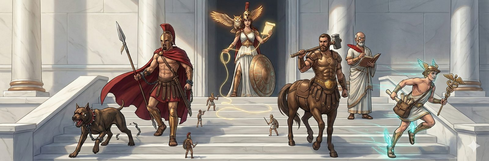

# The Mythology of Athena's Agora

_Ancient history meets digital modernity. Marble and circuits. Warriors who keep ledgers._

---

## The World

Somewhere between ancient Greece and a cyberpunk server room, there's a place called the Agora. Marble columns with circuit traces running through them. Mosaic floors that are half geometric art, half PCB layout. Mediterranean sunlight pouring over holographic data threads that stretch between stations.

In this place, small gladiator-like builders run everywhere — carrying glowing data tablets, constructing structures that are half stone and half hologram. It's busy, fun, slightly chaotic. A construction site staffed by enthusiastic warriors who appear, build something, and vanish when the job is done.

On a raised platform overlooking it all, a woman in Greek armour watches. An owl with blazing eyes sits on her shoulder. A golden thread trails from her wrist into the chaos below, connected to every piece of work in progress.

That's the Agora. That's what it looks like when AI agents build software.

---

## The Aesthetic

The ancient is the structure — architecture, clothing, mythology. The digital is the energy — light, data, glow. Neither dominates. They're fused.

Like someone excavated a Greek temple and found a server room underneath that was always there.

- Warm Mediterranean palette with electric accents
- Marble, bronze, circuit traces, holographic light
- Classical clothing with luminous data patterns woven in
- Illustrated concept art style, detailed, consistent across all characters

---

## The Characters

Each character has a **sigil**, **5 defining visual items**, and a clear identity. The test: a stranger should identify the character from a silhouette.

---

### 🦉 Athena — The Commander

**Sigil:** Owl with blazing eyes inside a shield

| # | Item | Description |
|---|------|-------------|
| 1 | **The Owl** | Blazing amber eyes. On her shoulder. Always. They are one being. |
| 2 | **The Aegis** | Round bronze shield with circuit patterns etched into the surface. Her signature item. |
| 3 | **Golden thread** | Wrapped around her left wrist, trailing off into the distance. Connected to every bead of work. |
| 4 | **Dispatch scroll** | Glowing, held in her right hand, unrolling. Orders going out to agents. |
| 5 | **Plumed helm** | Classical Greek, tall crest. She's the commander. Visible across the agora. |

**What she does:** Commands and orchestrates. Decomposes work, dispatches agents, watches progress, delivers results. She doesn't build — she makes builders better.

**Repo:** [athena-workspace](https://github.com/Perttulands/athena-workspace)

---

### 👁️ Argus — The Hound

**Sigil:** Paw print with an eye in the pad

| # | Item | Description |
|---|------|-------------|
| 1 | **Spiked bronze collar** | Distinctive from any angle. Etched with tally marks — one for every process he's killed. |
| 2 | **One glowing red eye** | The other is normal. Half natural dog, half scanner. You always know which eye is watching. |
| 3 | **Bared teeth** | Always. Even when calm. This dog doesn't smile. |
| 4 | **Broken chain leash** | Dragging behind him. Nobody controls Argus. He patrols on his own. |
| 5 | **Scars** | Across the muzzle. He's been in fights with bad processes and won every one. |

**What he does:** Watches the server every 5 minutes. Kills orphan processes. Restarts failed services. Files problem reports. Fixes things before you wake up.

**Repo:** [argus](https://github.com/Perttulands/argus)

---

### ⚔️ Centurion — The Centaur

**Sigil:** Horseshoe with a checkmark

| # | Item | Description |
|---|------|-------------|
| 1 | **Horse body** | He's a centaur. Instantly recognisable shape. Nobody else has four legs. |
| 2 | **Bronze chest plate** | Four symbols engraved: lint, test, scan, gate. His four trials. |
| 3 | **Inspection hammer** | He taps builds with it. If they ring hollow, down they come. |
| 4 | **Gold merge seal** | Hanging from his belt. He stamps worthy work with it. Earned, not given. |
| 5 | **Red brand** | In his off-hand. For rejections. You do not want the red brand. |

**What he does:** Walks the build sites. Runs lint, tests, Truthsayer scans — the full gauntlet. Nothing ships without his gold seal. He doesn't guard a gate. He goes to the work.

**Repo:** [athena-workspace](https://github.com/Perttulands/athena-workspace) (centurion.sh)

---

### ⚖️ Oathkeeper — The Spartan Controller

**Sigil:** A chain link with a quill through it

| # | Item | Description |
|---|------|-------------|
| 1 | **Spartan red cloak** | Long, dramatic. Nobody else wears red. Recognisable instantly. |
| 2 | **Bronze breastplate with ledger-bandolier** | The book is strapped across his armour. The ledger is part of him. |
| 3 | **Binding chain** | Wrapped around his forearm, always ready. His weapon is accountability. |
| 4 | **The Styx brand** | A glowing mark on his palm. He presses it onto fulfilled oaths. Burnt into the record. |
| 5 | **Quill-tipped spear** | His weapon writes, not stabs. The point is sharp enough for both. |

**What he does:** Scans agent transcripts for commitments. Tracks whether promises were fulfilled. Creates tracking beads for broken oaths. The Greeks swore by the River Styx. He checks the receipts.

**Repo:** [oathkeeper](https://github.com/Perttulands/oathkeeper)

---

### 🔍 Truthsayer — The Law Keeper

**Sigil:** A magnifying glass over a cracked surface

| # | Item | Description |
|---|------|-------------|
| 1 | **Bronze monocle** | Oversized, always on one eye. His signature item. You see the monocle, you know it's him. |
| 2 | **Dark robes with rule-text** | The fabric has the 88 rules stitched in gold thread. The law is literally woven into him. |
| 3 | **The Red Quill** | Thick, visible, always in hand. He marks violations in red. His ink is permanent. |
| 4 | **The Codex** | Heavy bronze-bound book chained to his belt. The law. He carries it everywhere. |
| 5 | **Cracked mirror** | Shows the surface and what's underneath. Two layers visible at once. Beauty above, rot below. |

**What he does:** Scans code for failure-hiding anti-patterns. 88 rules across 5 languages. Swallowed errors, mock leakage, missing timeouts, silent fallbacks. He enforces the laws of the codebase.

**Repo:** [truthsayer](https://github.com/Perttulands/truthsayer)

---

### 📡 Hermes — The Messenger

**Sigil:** Winged sandal with a lightning bolt

| # | Item | Description |
|---|------|-------------|
| 1 | **Winged sandals** | Leaving trails of data-light behind him. Classic, unmistakable. |
| 2 | **The Caduceus** | Two serpents wrapped around a staff — but the serpents are data streams. |
| 3 | **Messenger satchel** | Full of glowing scrolls. Always more coming. Never empty. |
| 4 | **Speed lines** | The only character always in motion. Caught mid-stride. Never standing still. |
| 5 | **Zero-loss tally** | A counter on his belt that reads "0 LOST". He's proud of it. |

**What he does:** Carries messages between agents. Filesystem-based communication, zero message loss, 26,000 msgs/sec. The nervous system of the Agora.

**Repo:** [relay](https://github.com/Perttulands/relay)

---

## The Places

---

### 🏛️ The Agora — The Workspace

**Sigil:** Column with circuit veins

An open Greek civic space. Marble columns, Mediterranean light, but the floor mosaics are half ancient geometric patterns and half PCB traces. Holographic data threads connect stations in the air. Small gladiator-builders run everywhere — carrying data tablets, constructing half-stone half-holographic structures. Athena watches from a raised platform, owl on shoulder.

This is what the system looks like in action. Busy, fun, slightly chaotic. A construction site staffed by enthusiastic warriors.

**Repo:** [athena-workspace](https://github.com/Perttulands/athena-workspace)

---

### 🏟️ Ludus Magnus — The Training Ground

**Sigil:** Four crossed swords in a circle

An open-air arena. Sunlit marble with holographic training dummies. Four sparring zones marked A, B, C, D — the four competing lineages. Floating score tablets showing 1-10 evaluations. Any agent — coding, research, customer service, analysis — trains here before deployment. An evolution spiral is carved into the arena floor.

**Repo:** [ludus-magnus](https://github.com/Perttulands/ludus-magnus)

---

### 🏛️ The Loom Room — Athena Web

**Sigil:** Three beads on a thread

A vast room with a great loom at its center. Threads glow in different colours — gold for open work, blue for in progress, green for done, red for blocked. Glass and bronze beads are strung on each thread. Where threads split and merge, you can see the git branches. Athena's golden thread runs from the loom to her wrist. This is where you stand to see the whole tapestry.

**Repo:** [athena-web](https://github.com/Perttulands/athena-web)

---

## The Symbols

---

### 🔄 The Ouroboros — Learning Loop

**Sigil:** Serpent eating its tail, half bronze half circuit board

A bronze serpent eating its own tail. Where it bites, the organic scales become circuit board. Flowers grow from the bite point — fiber optic blooms. Four rings mark the serpent's body: per-run, hourly, daily, weekly. A garden grows beneath it, fed by what the serpent consumes. Every ending feeds the next beginning.

**Repo:** [learning-loop](https://github.com/Perttulands/learning-loop)

---

### 🧵 Beads — The Loom's Thread

**Sigil:** Three beads on a thread

Glass and bronze beads strung on glowing threads. Each bead is a unit of work. Colour-coded: gold (open), blue (in progress), green (done), red (blocked). Part of the Loom Room but also exist independently — every workspace has them. Created by [Steve Yegge](https://github.com/steveyegge/beads), adopted into the Agora.

---

## The Voice

When writing for this world:

- **Confident, not arrogant.** We know what these tools do.
- **Dry humour over no humour.** A raised eyebrow, not a laugh track.
- **Ancient names, modern teeth.** The mythology is real. The tools run on Linux.
- **Honest about limitations.** If something's rough, say so.
- **The world is fun to be in.** Someone reading should want to explore more.
- **No thee/thou/forsooth.** Not a Renaissance faire.
- **No corporate voice.** Not "leveraging synergies."
- **No apologies for personality.** The personality is the point.

---

_This document is the source of truth for all mythology, character design, and visual identity._
